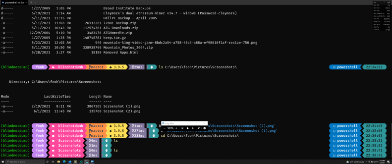

Title: 2021 - The Year Windows Became a First Class Python Development Environment
Date: 02021-06-02 17:54
Modified: 02021-06-08 22:12
Category: geekery
Tags: python,programming,development,desktop,tools
Authors: Chris Patti
Summary: Windows makes for a compelling choice for Python developers in 2021.


_[06/08/2021 Update: Added a bit about Windows Terminal. Dunno how I forgot that the first time around!]_

As I've written about previously and elsewhere, I felt so badly burned by Apple's laptop
hardware design decisions of a few years ago that I've rather fallen out of love with that platform for my personal work. The latest hardware is much better, but I feel like the message has been sent and received, so I'm not rushing back any time soon.

My first choice was the Linux desktop, and after months of struggling, instability and accessibility issues I'll admit I've been looking for stable, solid alternatives that are also powerful enough to get the job done and maybe even have something new to offer. As an old dog, sometimes it's really nice to be taught some new tricks!

If you've tangoed with Windows in the past, and found yourself struggling against its rather byzantine UI, I'd urge you to read on and see if maybe it's not time for another careful look.

Since choosing the right tools is all about your unique set of needs, I'll use those as categories to drive the discussion and showcase how Windows is doing a great job of satisfying them.

## In The Beginning, There Was The Command Line!

One of the things that first drew me to UNIX decades ago was the shell. The ability to get pretty much ANYTHING I needed done by typing a few commands, and to create **incredibly** powerful mechanisms by stringing them together is downright intoxicating.

I still love me some Bourne shell, it's just as powerful today as it was decades ago. However [Windows Powershell](https://docs.microsoft.com/en-us/powershell/scripting/overview?view=powershell-7.1) has some incredibly powerful paradigms of its own that are worth looking into.

In addition to things like object pipelines and desired state configuration that
the UNIX shell simply can't do, modern Powershell has creature comforts like [Oh My Posh](https://ohmyposh.dev/) that make for a very comfortable work environment. Here's a screenshot of mine:



You can see that I get all kinds of nice status like exit code of last command, current git branch, current Python version and virtual environment, etc.

While Powershell is indeed a totally different beast from the UNIX shell I'm used to, its built in help for **every** command and understandable syntax make the learning curve feel rather shallow indeed.

Another gripe most UNIX users have when coming to Windows is that everything requires mousing around and futzing with a GUI, and it can feel like you're trapped in an endless series of installer screens to get even your basic working tools installed. Modern Windows obviates all that with [winget](https://www.slashgear.com/microsofts-winget-1-0-released-for-real-heres-why-you-want-it-01675425/) a full fat package manager with tons of common applications already in there. Just ```winget install git``` and you're off to the races :)

## Before The Command Line, There Was The Terminal ##

As anyone who's worked with Windows for a long time could tell you, in the old days, the Windows Console was pretty primitive. You were basically dealing with MS-DOS CMD.EXE with the barest modicum of window dressing. Needless to say, this is 2021 and that's just not cutting it.

Thankfully, there is a superlative alternative that's really come into its own in 2021 - [Windows Terminal](https://github.com/microsoft/terminal). Finally all the features anyone who's been working in the UNIX world have come to expect over the last 30 years are available on Windows as well. Multiple tabs, excellent terminal emulation, great theming and color support, and the ability to seamlessly handle different shells per tab. I regularly keep a Powershell and a WSL tab open for my work.

If you've ever struggled along with the old CMD.EXE, fighting for every cut, paste or insert, this really is a game changer.

## I Hate Meeces To Pieces! (Really, Don't Make Me Use the Mouse!)

As someone who's partially blind and has fine and gross motor impairment, using the standard Windows Icons Mice and Pointers user interface is downright agonizing. I need to be able to launch apps with just a few keystrokes. On the Mac, [Alfred](https://www.alfredapp.com/) fulfills this role admirably and adds a whole host of next level productivity power ups in addition to keyboard app launching.

A **very** recent addition on the Windows side that seems equally powerful and easy is Microsoft Powertoys [Powertoys Run](https://docs.microsoft.com/en-us/windows/powertoys/run) feature. I can launch apps, bind keys to actions, and access system functions like sleep, restart and the like all 100% from the keyboard. Nice!

Another Powertoys addition that's frosting my Pop-tarts is [Powertoys Keyboard Manager](https://docs.microsoft.com/en-us/windows/powertoys/keyboard-manager) which allows me to remaps the dread CAPS LOCK key to Ctrl so it's right next to my pinky as God Intended :)

This simple enhanment has been impossible with Windows forever without resorting to more drastic measures, so having it work pretty much out of box now is super sweet.

## Python - It Takes a Cast of Thousands to Raise a Platform

If you'd uttered the words "Python" and "Windows" in the same sentence a few years back, the average Pythonista would have rolled their eyes or groaned and then proceeded to tell you a war story about how they had to spend weeks trying to get some critical module or other working.

Those days are just straight up gone. Microsoft and the Python community at large have poured countless engineer hours into making the Python ecosystem a truly first class experience under Windows. Virtual environments, poetry, and even tools for installing and managing command line scripts that integrate with the shell like [pipx](https://pypi.org/project/pipx/) work just great under Powershell on Windows.

And if by chance you're coding something up that's native UNIX to its very core, Windows **still* has you covered. Cue the Windows Subsystem for Linux!

## WSL - I See Penguins!

With the avent of WSL2 and most recently [WSL-g](https://github.com/microsoft/wslg) you really do have everything you need to seamlessly build, debug and run Linux programs on Windows, including those that require X/Wayland GUI support or sound.

It's not just some kind of compatibility shim, it's an **actual** Linux kernel running in Windows. The integration is so complete these days that you can run things like Docker within WSL successfully. That's a really big deal!

Also, most of the popular mainstream development tools like [Pycharm](https://www.jetbrains.com/pycharm/) and [Visual Studio Code](https://code.visualstudio.com/) have superlative support for deploying to and debugging in WSL built in.

The amount and quality of work Microsoft has put into this is truly impressive. And unlike the Mac, you're not actually using some oddball FreeBSD user space running atop the Mach microkernel, you're running 100% Linux. It's turtles all the way down.

## I Go Where The Innovation Is & Use What Works

As a technologist, I'm proud of the success I've had in sniffing out pockets of high velocity, high value innovation in the technology landscape.

Years ago, I was running Linux when many people were either using DOS, pre OSX MacOS or super expensive prorietary vendor workstations like Sun's Sparc. Being able to have an honest to god UNIX environment on commodity hardware was like Prometheus's gift of fire to the mortals. It really was that big a deal.

I still think the Linux desktop has incredible potential, but for me the obstacles imposed by my disabilities and the lack of accessibility features can be a real buzz and productivity killer.

So here I am embracing a desktop that works, with an ecosystem that works and a rather large well heeled company pouring resources into bar raising and innovation.

I look forward to exploring and leveraging the incredible potential this platform represents. Stay tuned for more posts as I go!